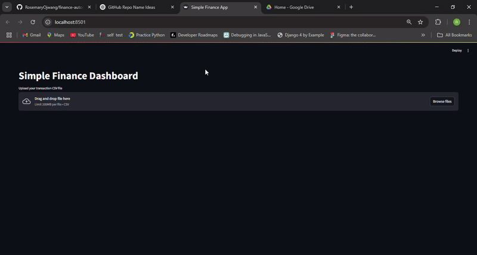

# Simple Finance App
A personal finance dashboard built with **Python**, **Pandas**, **Streamlit**, and **Plotly**.  
This app empowers you to take control of your finances through interactive visualizations and customizable transaction categorization.

This project is inspired by the YouTube tutorial [How To Automate Your Finances with Python](https://youtu.be/wqBlmAWqa6A?si=o4ho_91djL6ZXHY0)

---

## Features

- **Upload Transactions** — Import your CSV bank statements or budget exports  
- **Data Cleaning** — Clean and structure transaction data with Pandas  
- **Categorization** — Add/edit categories and assign keywords for automatic classification  
- **Dynamic Visualizations** — Analyze your spending patterns through:
  - Expense summary tables
  - Donut chart (Expenses vs Remaining Balance)
  - Bar chart (Expenses by Category)
  - Line chart (Daily Expenses over Time)
- **Keyword Learning** — The app “learns” which keywords belong to which categories over time

---

## Demo

---

## Tech Stack

- Python 3
- Pandas
- Streamlit
- Plotly

---
## Work in Progress

This app is constantly being refined! Upcoming improvements may include:

- Exportable reports
- Budget vs actual comparison
- More robust keyword matching
- Enhanced responsive layout

---

This is a practice project by **Rosemary Ojwang**, part of my learning journey in Data Analytics, upskilling in Python, data storytelling, and dashboard development. 

Feel free to fork, use, or contribute!

---